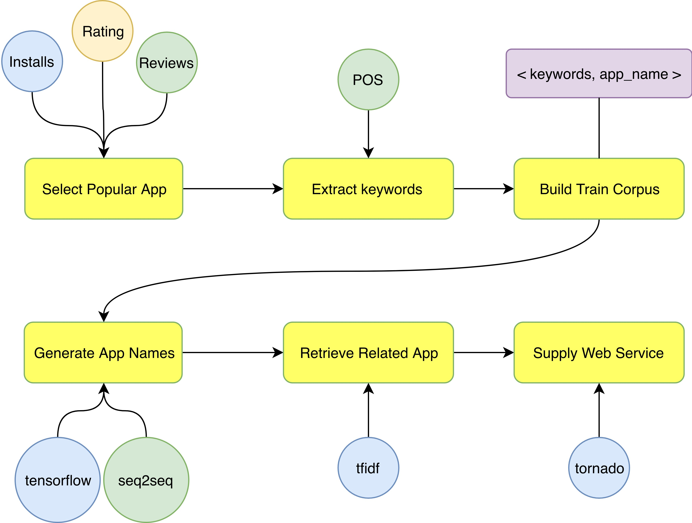
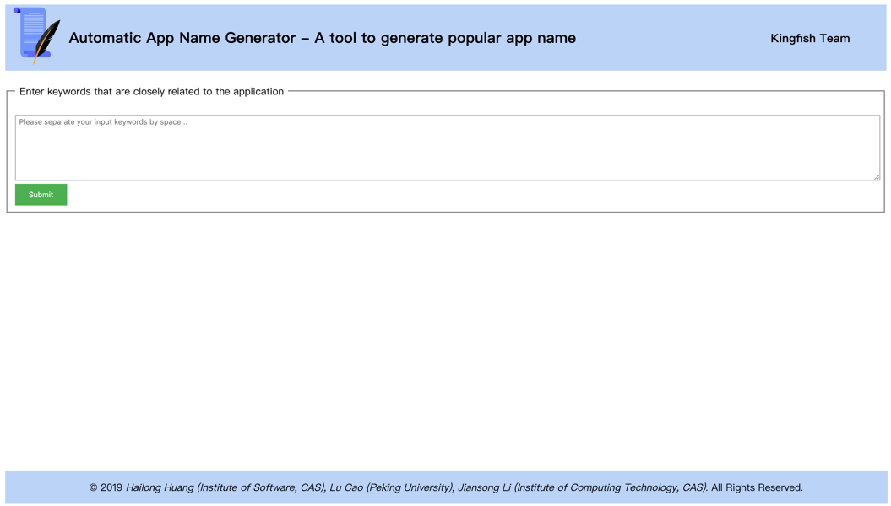
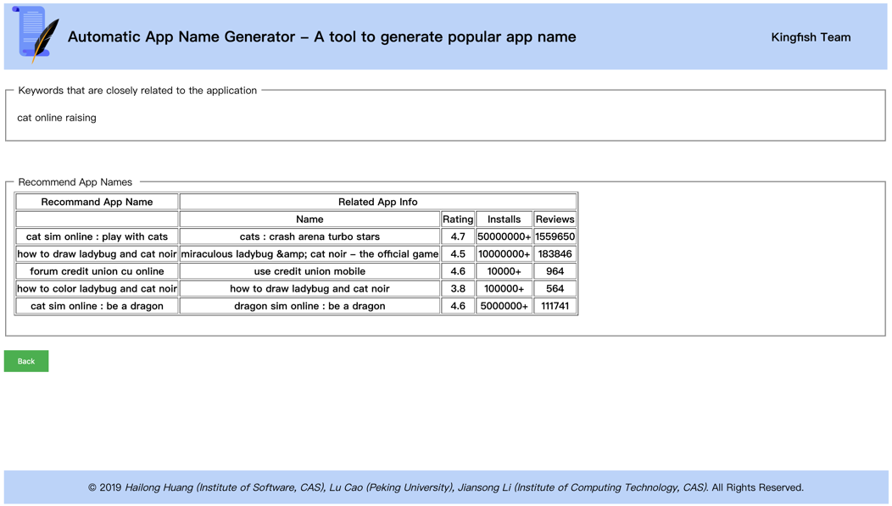

## Instructions

Based on the APP data set of Google Play store on Kaggle, we developed a tool that can assist developers to name their applications with keywords by using seq2seq, TF-IDF, POS and other technologies. We use Tornado and HTML/CSS to establish a front-end display page. Tools can provide popular application naming suggestions to application developers.

### Preprocess Data
```
cd data
python prepare_data.py googleplaystore.csv
```

### Train Model
```
nohup python -u train.py --root_path=model_v0 > log/v0.log 2>&1 &
```

### Start Server
```
nohup python -u server.py --batch_size=1 --use_beam_search=True --root_path=model_v0 > log/1-24.server.log 2>&1 &
```

### Architecture 


### Example

When you start the server, the address is http://you_compute_ip, then open it in browser.

#### Step 1. Input keywords related to your app



#### Step 2. Web page return names generated by the tool

> NOTE The first column is the model generated names which may be pupular if you take it as you app name. For the reason that evaluate the quality of generated names, we retrieve each generated name in original app names index to find the most similar app name, then display it's infomation. The generated app name may be good if the most similar app get good performance in installs, rating and reviews.


